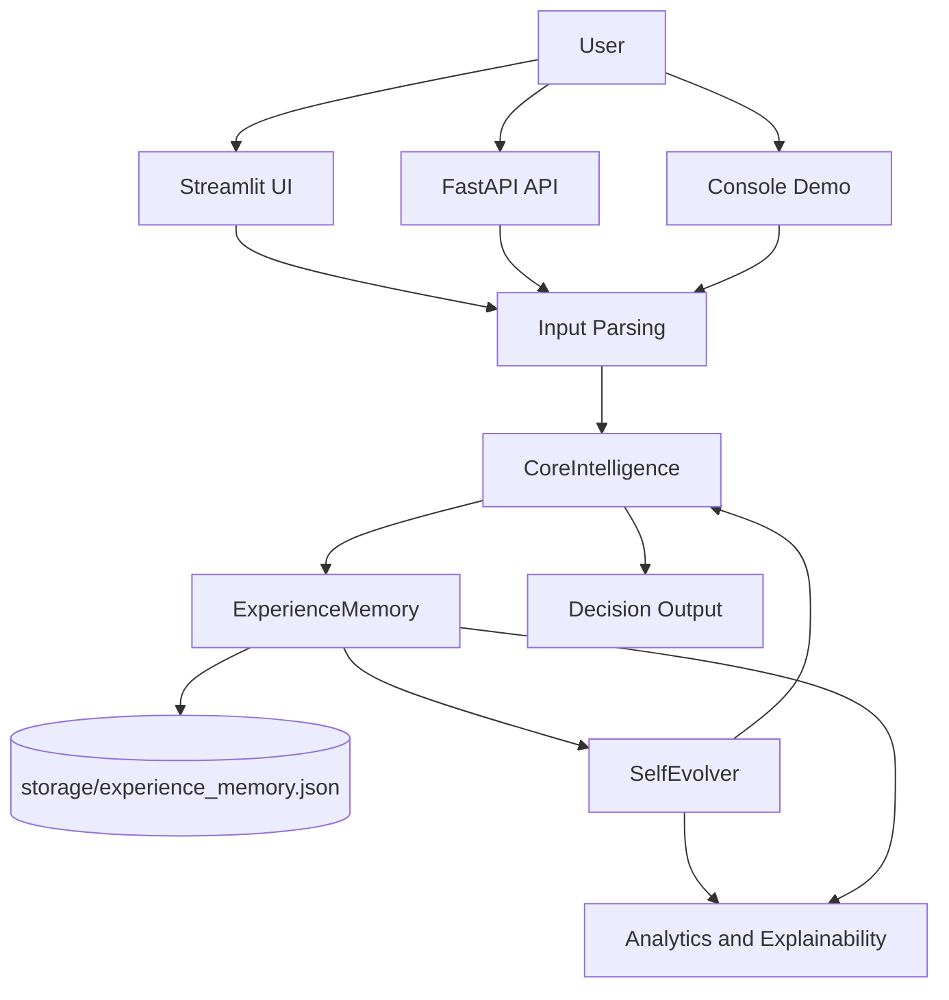
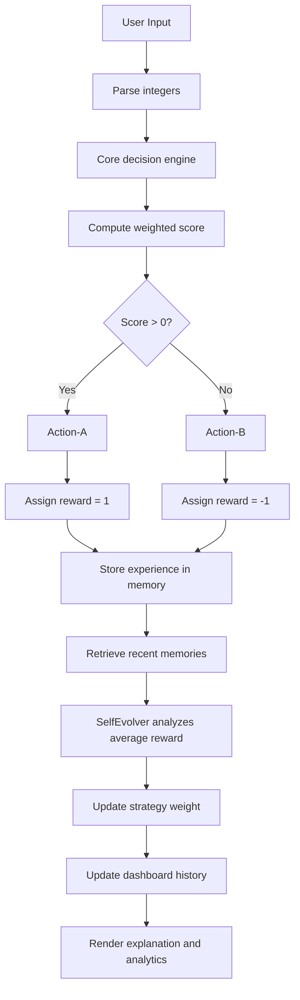

# Self-Evolving Intelligence System

> Runtime-adaptive intelligence prototype with a weighted decision engine, persistent experience memory, feedback-driven evolution, and a presentation-ready Streamlit dashboard.

[](https://github.com/IamChandu114/Self-Evolving-Intelligence-System)
[](runtime.txt)
[](https://streamlit.io)
[](https://fastapi.tiangolo.com)
[](https://plotly.com/python/)

> License: no license file is currently included in the repository.

---

## Overview

This project demonstrates a compact adaptive AI workflow built around three real runtime components:

- a decision engine that maps integer input signals to `Action-A` or `Action-B`
- an experience memory that stores and reloads interactions locally as JSON
- an evolution module that updates the strategy weight using recent reward feedback

The purpose is to show how a small, transparent, runtime-adaptive system can be presented clearly to technical and academic evaluators without exaggerating its capabilities. The repository is intentionally honest: it does not claim neural training, benchmark performance, or hidden intelligence beyond the code that actually exists.

## Motivation

Many AI demos are difficult to explain because the internal process is hidden behind large models or vague dashboard metrics. This project takes the opposite approach:

- keep the logic simple enough to explain live
- preserve the full feedback loop in memory
- expose every step of the runtime process in the UI
- make the project suitable for academic presentation and engineering review

The result is a lightweight research prototype that is easy to inspect, demonstrate, and extend.

## Key Features

| Feature | Implementation |
|---|---|
| Weighted decision engine | `CoreIntelligence.decide()` sums the integer input and multiplies it by the current strategy weight |
| Decision confidence | Confidence is derived from the weighted score using a bounded exponential helper |
| Feature contribution tracing | Each input value is tracked with a per-feature weighted contribution |
| Persistent memory | `ExperienceMemory` loads and saves JSON at `storage/experience_memory.json` |
| Memory search and filtering | Search, decision filtering, and confidence filtering are available in the dashboard |
| Memory export/reset | Memory can be exported as JSON or cleared from the UI |
| Feedback-driven evolution | `SelfEvolver.evolve()` adjusts strategy based on the recent average reward |
| Explainable runtime trace | The dashboard exposes decision details, feature contributions, memory match, and update reasoning |
| Runtime console | The UI records timestamped runtime events with severity and duration information |
| Analytics | Charts show memory growth, decision distribution, strategy evolution, reward history, runtime performance, and feedback trend |
| Architecture visualization | The dashboard includes a code-based architecture diagram that matches the repository structure |
| Project statistics | The app counts Python files, functions, classes, modules, and repository folders |
| Presentation mode | The Streamlit sidebar can hide developer controls for a cleaner live demo |
| API endpoint | FastAPI exposes the same decision loop at `/decide` |

## System Architecture



## AI Decision Workflow



## Repository Structure

```text
.
|-- .devcontainer/
|-- .streamlit/
|   `-- config.toml
|-- api/
|   |-- __init__.py
|   `-- server.py
|-- core/
|   |-- __init__.py
|   `-- intelligence.py
|-- evolution/
|   |-- __init__.py
|   `-- self_evolver.py
|-- memory/
|   |-- __init__.py
|   `-- experience_memory.py
|-- ui/
|   |-- __init__.py
|   |-- app.py
|   |-- dashboard.py
|   `-- dashboard_utils.py
|-- main.py
|-- requirements.txt
|-- runtime.txt
`-- README.md
```

> Runtime JSON data is written to `storage/experience_memory.json` and created automatically when the app runs.

## Technology Stack

| Layer | Tools Used | Purpose |
|---|---|---|
| Language | Python 3.10.13 | Core application and runtime logic |
| UI | Streamlit 1.29.0 | Interactive dashboard and live presentation interface |
| API | FastAPI 0.115.6 | Minimal REST interface for the decision engine |
| ASGI server | Uvicorn 0.32.1 | Runs the FastAPI app locally |
| Data handling | Pandas 2.3.3 | Tabular views and chart data preparation |
| Charts | Plotly 5.24.1 | Enhanced analytics charts with Streamlit fallback support |
| Packaging | `requirements.txt`, `runtime.txt` | Streamlit Community Cloud deployment settings |
| Local persistence | JSON files | Session-to-session memory storage |

## Installation

### 1. Clone the repository

```bash
git clone https://github.com/IamChandu114/Self-Evolving-Intelligence-System.git
cd Self-Evolving-Intelligence-System
```

### 2. Use Python 3.10.13

This project is configured for Python 3.10.13 via `runtime.txt`.

If you manage Python manually, create or activate a 3.10 environment before installing dependencies.

### 3. Install dependencies

```bash
pip install -r requirements.txt
```

## Running the Project

### Streamlit dashboard

```bash
streamlit run ui/app.py
```

### FastAPI server

```bash
uvicorn api.server:app --reload
```

### Console demo

```bash
python main.py
```

### Streamlit Community Cloud

- Main file path: `ui/app.py`
- Python runtime: `python-3.10.13`
- Dependency file: `requirements.txt`

## Dashboard Walkthrough

### 1. Header

- Project title and subtitle
- Current runtime status
- Project version from the API module
- Presentation Mode toggle

### 2. KPI Row

The dashboard shows real runtime values for:

- Strategy Confidence
- Memory Size
- Decision Confidence
- Inference Time
- Learning Iterations
- Runtime Status

### 3. Input and Pipeline

- Accepts comma-separated or space-separated integers
- Lets the user choose the recent-memory window
- Shows the AI processing pipeline with the active stage highlighted during execution

### 4. Decision Output and Explainability

- Displays the selected decision
- Shows confidence, execution time, and current strategy weight
- Expands a Decision Trace that includes:
  - input analysis
  - feature contributions
  - memory match
  - reasoning
  - decision
  - feedback
  - memory update

### 5. Memory Dashboard

- Displays stored experiences
- Supports memory search
- Supports decision filtering
- Supports minimum-confidence filtering
- Exports memory as JSON
- Clears local memory on demand
- Shows feedback history and memory growth

### 6. Runtime Activity Console

- Logs timestamped runtime events
- Shows the log severity
- Displays execution duration where available
- Supports collapsible history and level-based filtering

### 7. Analytics Dashboard

- Memory Growth
- Decision Distribution
- Strategy Evolution
- Reward History
- Runtime Performance
- Feedback Trend

### 8. System Architecture

- A code-based flow diagram that mirrors the project components
- Useful for academic explanation and live walkthroughs

### 9. Project Statistics

- Counts modules, Python files, functions, classes, and repository folders
- Shows the current runtime specification and memory size

## Core Components

### Decision Engine

`core/intelligence.py` contains `CoreIntelligence`.

- Accepts a list of integers
- Computes a weighted sum using `strategy_weight`
- Returns `Action-A` when the score is positive, otherwise `Action-B`
- Derives a bounded confidence value from the score
- Stores feature contributions for explainability

### Memory System

`memory/experience_memory.py` contains `ExperienceMemory`.

- Stores each interaction with timestamp, input, decision, reward, and metadata
- Saves and reloads experiences from local JSON
- Creates the storage directory automatically when needed
- Supports `search()`, `filter_entries()`, `export_json()`, and `reset()`

### Evolution Module

`evolution/self_evolver.py` contains `SelfEvolver`.

- Reads the most recent experiences from memory
- Computes the average recent reward
- Decreases or increases the strategy weight using the current rule
- Tracks the evolution history and the last update summary

### Explainability

The explainability view is built from the actual runtime output:

- input sum
- feature contributions
- weighted score
- decision
- decision margin
- recent memory context
- reward and adaptation reason

### Analytics

Analytics are generated from runtime history and memory entries:

- Strategy weight over time
- Memory growth over time
- Decision distribution
- Reward history
- Confidence history
- Inference time over time

If Plotly is unavailable, the dashboard falls back to Streamlit chart components.

### Presentation Mode

Presentation Mode is a sidebar toggle intended for demos and projector use.

- Hides developer controls
- Keeps the interface cleaner for non-technical audiences
- Preserves the same backend behavior

## Project Screenshots

Add screenshots to a `docs/screenshots/` folder when preparing the final release package.

| Screenshot | Suggested Filename | Purpose |
|---|---|---|
| Dashboard home | `docs/screenshots/dashboard-home.png` | Main executive view of the app |
| Decision trace | `docs/screenshots/decision-trace.png` | Explainability walkthrough |
| Memory dashboard | `docs/screenshots/memory-dashboard.png` | Stored experience view |
| Analytics view | `docs/screenshots/analytics.png` | Charts and trend summary |
| Architecture view | `docs/screenshots/architecture.png` | System explanation slide |

## Real-World Applications

This project is suitable for:

- academic demonstrations of adaptive decision loops
- explainable runtime feedback systems
- prototype evaluations of memory-driven behavior
- UI/UX demos for AI dashboard presentations
- teaching the difference between rule-based adaptation and model training

## Current Limitations

- The system is rule-based, not a trained neural model
- Memory persistence is local JSON, not a database
- There is no automated test suite in the repository
- There is no authentication or user management layer
- The project does not claim benchmarked accuracy or production-scale performance

## Future Enhancements

- Add a small automated test suite
- Add optional SQLite persistence
- Add import/export for full sessions
- Add richer feedback policies
- Add downloadable reports for presentations
- Add CI workflows for continuous validation
- Add screenshot assets for the README and demo deck

## Learning Outcomes

This repository demonstrates practical engineering concepts including:

- modular Python project structure
- Streamlit session-state management
- FastAPI endpoint design
- runtime state persistence
- explainable decision logging
- charting and dashboard composition
- simple reward-based adaptation
- Cloud-friendly packaging with `runtime.txt`

It is also a useful example of how to present a technically honest AI prototype without overstating the implementation.

## License

No license file is currently included in this repository.

## Author

- GitHub: [IamChandu114](https://github.com/IamChandu114)
- LinkedIn: linkedin.com/in/pace1304/
- Email: `ca4443700@gmail.com`

---

If you want, I can also turn this into a more compact "academic poster" README version or add matching screenshot folders and captions next.
